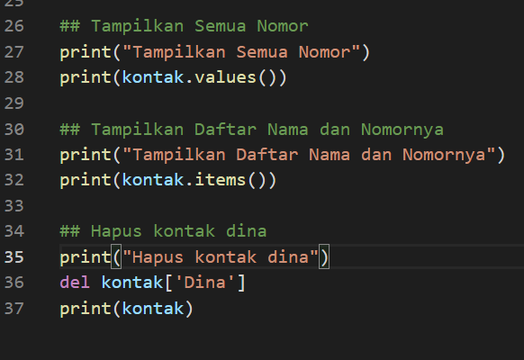

# Praktikum5

## Nama  : Cecilia Sitompul
## Nim   : 312110207
## Kelas : TI.21.C1

### Latihan
Berikut scriptnya:

untuk membuat dictionary menggunakan kurung kurawal {} dan untuk memanggil digunakan kurung siku [] 
saya menggunakan kontak sebagai variabel
print('Ari',kontak['Ari]) untuk menampilkan kontak ari
kontak['Riko'] = 087654544 untuk menambahkan key baru 'Riko' dengan value '087654544
lalu jika ingin mengubah value dari key,misalnya ingin mengubah value dari dina maka, kontak['Dina']=.... lalu isi sesuai dengan value yang diinginkan
lalu menggunakan .keys untuk menampilkan nama, .values untuk menampilkan nomor dan .items untuk menampilkan nama dan nomornya.
jika ingin menghapus salah satu, misalnya ingin mneghapus dina, maka del kontak['Dina'] maka kontak dina pun akan terhapus.

Seperti ini outputnya :

### Praktikum

Berikut ini scripnya :

membuat variabel c yang isinya adalah, T)ambah, U)bah, H)apus, L)ihat, C)ari, K)eluar

Lalu user menginputkan kode

jika user menginput kode l, maka program akan menunjukkan tabel dengan tidak ada data didalamnya.

jika menginput kode t, maka user diarahkan untuk menambahkan data mahasiswa yang terdiri atas nama, nim, nilai tugas, nilai uts, nilai tugas, lalu program akan memproses dari nilai tersebut, 30% dari nilai tugas, 35% dari nilai UTS dan 35% dari nilai UAS, misalnya disini saya menambahkan 2 data mahasiswa yaitu Cecilia dan Angga dengan nilai seperti yang tertera dibawah ini

lalu input kode l untuk melihat tabel data mahasiswa

lalu jika user menginput kode u, maka program akan mengarahkan user untuk mengubah data dengan nama siapa, setelah itu mengisi kembali nim, nilai tugas, nilai uts, dan nilai uas. maka programpun akan mengubah datanya sesuai dengan yang diinput oleh user menggunakan dictionary keys untuk mengambil seluruh kuncinya.
lalu input kode l untuk melihat tabel datanya

jika user menghapus data salah satu mahasiswa, user mengisi kode h. dan disana menggunakan keyword del untuk menghapus data mahasiswa. lalu user menginputkan nama mahasiswa yang datanya ingin dihapus, maka programpun akan menghapus data mahasiswa tersebut.

jika user ingin melihat data salah satu mahasiswa, maka user menginput kode c, lalu menginput nama mahasiswa yang datanya ingin dicari lalu program akan menampilkan data mahasiswa tersebut 

lalu jika ingin keluar dari programnya, user menginput kode k dan program telah selesai :)

### FLowchart

# SELESAI :)